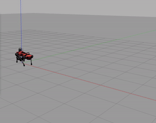

# RBE521_Spot
RBE521 Term Project

                   

This project was run on Ubuntu 20.04 with ROS Noetic

This project uses the champ package, for more information see: https://github.com/chvmp/champ

To install and run this package, follow the below commands:

A catkin workspace should be used for this project:
use catkin_make to create the workspace

When a new terminal is launched, please always run the following first:
```
cd /path/to/catkin_ws
source devel/setup.bash
```

Clone the Repo in src of your workspace:
```
sudo apt install -y python-rosdep
cd <your_ws>/src
gitclone https://github.com/mweissman2/Spot_Sim.git
```

Depending on what robot you want to work with, you can clone the description repos of those robots. For eg: If you want to work with Spot, use
```
git clone -b gazebo https://github.com/chvmp/spot_ros
```

For Anymal C:
```
git clone https://github.com/chvmp/anymal_c_simple_description
```

Similar commands for all the available robots can be found in /robots/install_descriptions
For installing the description files for all the robots run:
```
cd robots
./install_descriptions
```

cd back into workspace 
```
cd ..
rosdep install --from-paths src --ignore-src -r -y
catkin_make
```

Running the programs:
To launch the spot robot in the outdoor environment in Gazebo run the following:
```
roslaunch spot_config gazebo.launch
```
To launch anymal c in outdoor environment in Gazebo run the following:
```
roslaunch anymal_c_config gazebo.launch
```
In another terminal, run the following for teleoperation (or publish custom Twist msg over \cmd_vel)
```
roslaunch champ_teleop teleop.launch
```
To run the data acquisition for capturing foot position data, run the following:
```
rosrun data_acq foot_pos.py
```

Note: if you desire to the simulation with a different robot configuration, simply change spot_config in the previous command to the desired robot config.
Ex: anymal_c_config

Note: Sometimes the gazebo simulation may be slow in the outdoor environment, if this is the case, run the following to launch the simulation in an empty world:
```
roslaunch spot_config gazebo.launch gazebo_world:="default"
```


